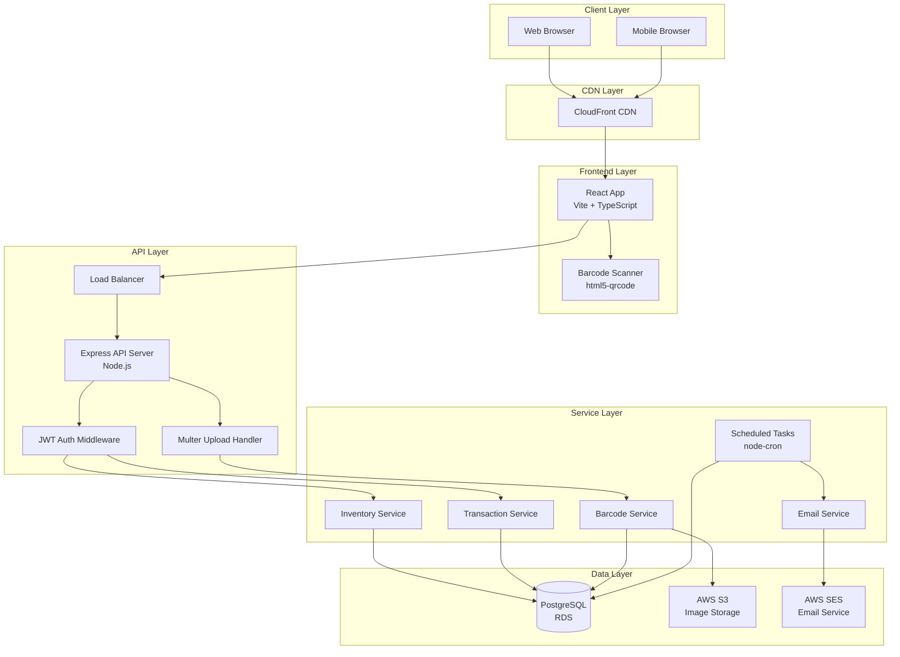

# Design Document

## Overview

The Warehouse Management SaaS is a three-tier cloud-native application built with React 18 frontend, Node.js/Express backend, and PostgreSQL database. The system provides real-time inventory management, barcode scanning, automated alerts, and role-based access control for warehouse operations supporting 10 concurrent users.

### Technology Stack

**Frontend:**
- React 18 with TypeScript for type safety
- Vite as build tool for fast development
- Tailwind CSS for responsive UI styling
- html5-qrcode library for barcode scanning
- Axios for HTTP client
- Zustand for lightweight state management

**Backend:**
- Node.js 18+ with Express framework
- JWT for stateless authentication
- Multer for multipart file uploads
- node-cron for scheduled tasks
- qrcode library for barcode generation
- bcrypt for password hashing

**Database:**
- PostgreSQL 14+ with connection pooling
- Indexed queries for performance
- Database views for complex queries

**Infrastructure:**
- AWS S3 for image storage
- AWS SES or SendGrid for email notifications
- Docker for containerization
- CloudFront CDN for frontend delivery

## Architecture

### System Architecture Diagram



### Request Flow

1. **Authentication Flow:**
   - User submits credentials → API validates → JWT token generated → Token stored in browser localStorage
   - Subsequent requests include JWT in Authorization header → Middleware validates token and role

2. **Inventory Operations Flow:**
   - User requests inventory list → API queries database with filters → Returns paginated results
   - User updates stock → API validates permissions → Creates transaction record → Updates inventory → Returns success

3. **Barcode Scanning Flow:**
   - User opens scanner → Camera activated → Barcode detected → API searches by barcode → Returns product → User updates stock

4. **Image Upload Flow:**
   - User selects image → Multer processes multipart form → File validated → Uploaded to S3 → URL stored in database

5. **Alert Flow:**
   - Cron job runs daily → Queries low stock view → Generates email content → Sends via SES → Logs result

## Components and Interfaces

### Frontend Components

#### 1. Layout Components

**Sidebar Component**
```typescript
interface SidebarProps {
  currentRoute: string;
  userRole: 'Admin' | 'Manager' | 'Staff';
}

// Renders navigation menu with role-based visibility
// Highlights active route
// Displays WMS logo and branding
```

**Header Component**
```typescript
interface HeaderProps {
  pageTitle: string;
  userName: string;
  userAvatar: string;
  onLogout: () => void;
}

// Displays page title, notification bell, user info
// Handles logout action
```

#### 2. Dashboard Components

**KPI Card Component**
```typescript
interface KPICardProps {
  title: string;
  value: number;
  icon: string;
  iconColor: string;
  bgColor: string;
}

// Displays metric with icon and styling
// Used for total products, low stock, recent activity
```

**Inventory Table Component**
```typescript
interface InventoryTableProps {
  items: InventoryItem[];
  onItemClick: (id: string) => void;
  showActions: boolean;
}

interface InventoryItem {
  id: string;
  sku: string;
  name: string;
  currentStock: number;
  minThreshold: number;
  status: 'In Stock' | 'Low Stock' | 'Out of Stock';
  location: string;
  category: string;
}

// Displays inventory in table format
// Color-coded status badges
// Sortable columns
// Click to view details
```

#### 3. Inventory Management Components

**Product Form Component**
```typescript
interface ProductFormProps {
  mode: 'create' | 'edit';
  initialData?: InventoryItem;
  onSubmit: (data: ProductFormData) => Promise<void>;
  onCancel: () => void;
}

interface ProductFormData {
  name: string;
  location: string;
  category: string;
  subCategory: string;
  shelf: string;
  description: string;
  currentStock: number;
  minThreshold: number;
  image?: File;
}

// Form validation with error messages
// Image preview before upload
// Category dropdown with subcategories
```

**Stock Update Modal**
```typescript
interface StockUpdateProps {
  product: InventoryItem;
  onUpdate: (quantity: number, reason: string, type: 'addition' | 'deduction') => Promise<void>;
  onClose: () => void;
}

// Modal for quick stock adjustments
// Reason field required
// Shows current stock and calculates new stock
```

#### 4. Scanner Component

**Barcode Scanner Component**
```typescript
interface BarcodeScannerProps {
  onScanSuccess: (barcode: string) => void;
  onScanError: (error: string) => void;
}

// Activates device camera
// Detects and decodes QR codes
// Manual entry fallback
// Shows scanning status and feedback
```

#### 5. Transaction Components

**Transaction List Component**
```typescript
interface TransactionListProps {
  transactions: Transaction[];
  filters: TransactionFilters;
  onFilterChange: (filters: TransactionFilters) => void;
}

interface Transaction {
  id: string;
  timestamp: Date;
  productName: string;
  userName: string;
  quantityChange: number;
  reason: string;
  transactionType: 'addition' | 'deduction';
}

interface TransactionFilters {
  dateFrom?: Date;
  dateTo?: Date;
  productId?: string;
  userId?: string;
}

// Filterable transaction history
// Date range picker
// Export functionality
```

#### 6. User Management Components (Admin Only)

**User List Component**
```typescript
interface UserListProps {
  users: User[];
  onEdit: (userId: string) => void;
  onDeactivate: (userId: string) => void;
}

interface User {
  id: string;
  username: string;
  email: string;
  role: 'Admin' | 'Manager' | 'Staff';
  createdAt: Date;
  isActive: boolean;
}

// Admin-only user management
// Role assignment
// User activation/deactivation
```

### Backend API Endpoints

#### Authentication Routes

```
POST /api/auth/login
Request: { username: string, password: string }
Response: { token: string, user: { id, username, email, role } }
Status: 200 OK | 401 Unauthorized

POST /api/auth/register (Admin only)
Request: { username: string, email: string, password: string, role: string }
Response: { user: { id, username, email, role } }
Status: 201 Created | 403 Forbidden | 400 Bad Request

GET /api/auth/me
Headers: Authorization: Bearer <token>
Response: { user: { id, username, email, role } }
Status: 200 OK | 401 Unauthorized
```

#### Inventory Routes

```
GET /api/inventory
Query: ?search=<term>&category=<cat>&status=<status>&page=<num>&limit=<num>
Headers: Authorization: Bearer <token>
Response: { items: InventoryItem[], total: number, page: number, pages: number }
Status: 200 OK | 401 Unauthorized

GET /api/inventory/:id
Headers: Authorization: Bearer <token>
Response: { item: InventoryItem }
Status: 200 OK | 404 Not Found | 401 Unauthorized

POST /api/inventory (Manager/Admin only)
Headers: Authorization: Bearer <token>
Request: ProductFormData (multipart/form-data)
Response: { item: InventoryItem, barcode: string }
Status: 201 Created | 403 Forbidden | 400 Bad Request

PUT /api/inventory/:id (Manager/Admin only)
Headers: Authorization: Bearer <token>
Request: Partial<ProductFormData>
Response: { item: InventoryItem }
Status: 200 OK | 404 Not Found | 403 Forbidden

DELETE /api/inventory/:id (Admin only)
Headers: Authorization: Bearer <token>
Response: { message: string }
Status: 200 OK | 404 Not Found | 403 Forbidden

POST /api/inventory/:id/stock
Headers: Authorization: Bearer <token>
Request: { quantity: number, reason: string, type: 'addition' | 'deduction' }
Response: { item: InventoryItem, transaction: Transaction }
Status: 200 OK | 400 Bad Request | 401 Unauthorized

GET /api/inventory/barcode/:code
Headers: Authorization: Bearer <token>
Response: { item: InventoryItem }
Status: 200 OK | 404 Not Found | 401 Unauthorized
```

#### Transaction Routes

```
GET /api/transactions (Manager/Admin only)
Query: ?dateFrom=<date>&dateTo=<date>&productId=<id>&userId=<id>&page=<num>&limit=<num>
Headers: Authorization: Bearer <token>
Response: { transactions: Transaction[], total: number, page: number, pages: number }
Status: 200 OK | 403 Forbidden | 401 Unauthorized

GET /api/transactions/:id (Manager/Admin only)
Headers: Authorization: Bearer <token>
Response: { transaction: Transaction }
Status: 200 OK | 404 Not Found | 403 Forbidden
```

#### User Routes

```
GET /api/users (Admin only)
Headers: Authorization: Bearer <token>
Response: { users: User[] }
Status: 200 OK | 403 Forbidden

PUT /api/users/:id (Admin only)
Headers: Authorization: Bearer <token>
Request: { role?: string, isActive?: boolean }
Response: { user: User }
Status: 200 OK | 404 Not Found | 403 Forbidden

DELETE /api/users/:id (Admin only)
Headers: Authorization: Bearer <token>
Response: { message: string }
Status: 200 OK | 404 Not Found | 403 Forbidden
```

#### Dashboard Routes

```
GET /api/dashboard/metrics
Headers: Authorization: Bearer <token>
Response: {
  totalProducts: number,
  lowStockCount: number,
  recentTransactions: number,
  outOfStockCount: number
}
Status: 200 OK | 401 Unauthorized
```

### Backend Services

#### Inventory Service

```typescript
class InventoryService {
  async getAllInventory(filters: InventoryFilters, pagination: Pagination): Promise<PaginatedResult<InventoryItem>>
  async getInventoryById(id: string): Promise<InventoryItem>
  async getInventoryByBarcode(barcode: string): Promise<InventoryItem>
  async createInventory(data: ProductFormData, userId: string): Promise<InventoryItem>
  async updateInventory(id: string, data: Partial<ProductFormData>, userId: string): Promise<InventoryItem>
  async deleteInventory(id: string): Promise<void>
  async updateStock(id: string, quantity: number, reason: string, type: string, userId: string): Promise<{ item: InventoryItem, transaction: Transaction }>
  async getLowStockItems(): Promise<InventoryItem[]>
}
```

#### Transaction Service

```typescript
class TransactionService {
  async createTransaction(data: TransactionData): Promise<Transaction>
  async getTransactions(filters: TransactionFilters, pagination: Pagination): Promise<PaginatedResult<Transaction>>
  async getTransactionById(id: string): Promise<Transaction>
  async getRecentTransactions(hours: number): Promise<Transaction[]>
}
```

#### Barcode Service

```typescript
class BarcodeService {
  async generateBarcode(productId: string): Promise<string>
  async generateQRCodeImage(data: string): Promise<Buffer>
}
```

#### Image Service

```typescript
class ImageService {
  async uploadImage(file: Express.Multer.File, productId: string): Promise<string>
  async deleteImage(imageUrl: string): Promise<void>
  validateImageFile(file: Express.Multer.File): boolean
}
```

#### Email Service

```typescript
class EmailService {
  async sendLowStockAlert(items: InventoryItem[], recipients: string[]): Promise<void>
  async sendEmail(to: string[], subject: string, html: string): Promise<void>
  generateLowStockEmailHTML(items: InventoryItem[]): string
}
```

### Middleware

#### Authentication Middleware

```typescript
function authenticateToken(req: Request, res: Response, next: NextFunction): void
// Validates JWT token from Authorization header
// Attaches user object to request
// Returns 401 if token invalid or missing
```

#### Authorization Middleware

```typescript
function requireRole(roles: string[]): RequestHandler
// Checks if authenticated user has required role
// Returns 403 if user lacks permission
```

#### Validation Middleware

```typescript
function validateRequest(schema: Joi.Schema): RequestHandler
// Validates request body against Joi schema
// Returns 400 with detailed errors if validation fails
```

#### Error Handler Middleware

```typescript
function errorHandler(err: Error, req: Request, res: Response, next: NextFunction): void
// Catches all errors
// Logs error details
// Returns appropriate status code and sanitized message
```

## Data Models

### Database Schema

```sql
-- Users Table
CREATE TABLE users (
  id UUID PRIMARY KEY DEFAULT gen_random_uuid(),
  username VARCHAR(50) UNIQUE NOT NULL,
  email VARCHAR(255) UNIQUE NOT NULL,
  password_hash VARCHAR(255) NOT NULL,
  role VARCHAR(20) NOT NULL CHECK (role IN ('Admin', 'Manager', 'Staff')),
  is_active BOOLEAN DEFAULT true,
  created_at TIMESTAMP DEFAULT CURRENT_TIMESTAMP,
  updated_at TIMESTAMP DEFAULT CURRENT_TIMESTAMP
);

CREATE INDEX idx_users_username ON users(username);
CREATE INDEX idx_users_email ON users(email);

-- Categories Table
CREATE TABLE categories (
  id UUID PRIMARY KEY DEFAULT gen_random_uuid(),
  name VARCHAR(100) UNIQUE NOT NULL,
  description TEXT,
  parent_id UUID REFERENCES categories(id) ON DELETE SET NULL,
  created_at TIMESTAMP DEFAULT CURRENT_TIMESTAMP
);

CREATE INDEX idx_categories_parent ON categories(parent_id);

-- Inventory Table
CREATE TABLE inventory (
  id UUID PRIMARY KEY DEFAULT gen_random_uuid(),
  name VARCHAR(255) NOT NULL,
  location VARCHAR(100) NOT NULL,
  category_id UUID REFERENCES categories(id) ON DELETE SET NULL,
  sub_category_id UUID REFERENCES categories(id) ON DELETE SET NULL,
  shelf VARCHAR(50),
  description TEXT,
  image_url VARCHAR(500),
  barcode VARCHAR(100) UNIQUE NOT NULL,
  current_stock INTEGER NOT NULL DEFAULT 0 CHECK (current_stock >= 0),
  min_threshold INTEGER NOT NULL DEFAULT 10 CHECK (min_threshold >= 0),
  created_at TIMESTAMP DEFAULT CURRENT_TIMESTAMP,
  updated_at TIMESTAMP DEFAULT CURRENT_TIMESTAMP
);

CREATE INDEX idx_inventory_barcode ON inventory(barcode);
CREATE INDEX idx_inventory_category ON inventory(category_id);
CREATE INDEX idx_inventory_name ON inventory(name);
CREATE INDEX idx_inventory_stock ON inventory(current_stock);

-- Transactions Table
CREATE TABLE transactions (
  id UUID PRIMARY KEY DEFAULT gen_random_uuid(),
  item_id UUID NOT NULL REFERENCES inventory(id) ON DELETE CASCADE,
  user_id UUID NOT NULL REFERENCES users(id) ON DELETE SET NULL,
  quantity INTEGER NOT NULL,
  reason TEXT NOT NULL,
  transaction_type VARCHAR(20) NOT NULL CHECK (transaction_type IN ('addition', 'deduction')),
  created_at TIMESTAMP DEFAULT CURRENT_TIMESTAMP
);

CREATE INDEX idx_transactions_item ON transactions(item_id);
CREATE INDEX idx_transactions_user ON transactions(user_id);
CREATE INDEX idx_transactions_created ON transactions(created_at DESC);

-- Database View for Low Stock Items
CREATE VIEW v_low_stock_items AS
SELECT 
  i.id,
  i.name,
  i.location,
  i.current_stock,
  i.min_threshold,
  c.name as category_name
FROM inventory i
LEFT JOIN categories c ON i.category_id = c.id
WHERE i.current_stock <= i.min_threshold;

-- Trigger to Update updated_at
CREATE OR REPLACE FUNCTION update_updated_at_column()
RETURNS TRIGGER AS $$
BEGIN
  NEW.updated_at = CURRENT_TIMESTAMP;
  RETURN NEW;
END;
$$ language 'plpgsql';

CREATE TRIGGER update_inventory_updated_at BEFORE UPDATE ON inventory
FOR EACH ROW EXECUTE FUNCTION update_updated_at_column();

CREATE TRIGGER update_users_updated_at BEFORE UPDATE ON users
FOR EACH ROW EXECUTE FUNCTION update_updated_at_column();
```

### TypeScript Interfaces

```typescript
// User Model
interface User {
  id: string;
  username: string;
  email: string;
  passwordHash: string;
  role: 'Admin' | 'Manager' | 'Staff';
  isActive: boolean;
  createdAt: Date;
  updatedAt: Date;
}

// Category Model
interface Category {
  id: string;
  name: string;
  description?: string;
  parentId?: string;
  createdAt: Date;
}

// Inventory Model
interface InventoryItem {
  id: string;
  name: string;
  location: string;
  categoryId?: string;
  subCategoryId?: string;
  shelf?: string;
  description?: string;
  imageUrl?: string;
  barcode: string;
  currentStock: number;
  minThreshold: number;
  createdAt: Date;
  updatedAt: Date;
}

// Transaction Model
interface Transaction {
  id: string;
  itemId: string;
  userId: string;
  quantity: number;
  reason: string;
  transactionType: 'addition' | 'deduction';
  createdAt: Date;
}

// JWT Payload
interface JWTPayload {
  userId: string;
  username: string;
  role: string;
  iat: number;
  exp: number;
}
```

## Error Handling

### Error Types

```typescript
class AppError extends Error {
  statusCode: number;
  isOperational: boolean;
  
  constructor(message: string, statusCode: number) {
    super(message);
    this.statusCode = statusCode;
    this.isOperational = true;
    Error.captureStackTrace(this, this.constructor);
  }
}

class ValidationError extends AppError {
  constructor(message: string) {
    super(message, 400);
  }
}

class AuthenticationError extends AppError {
  constructor(message: string = 'Authentication failed') {
    super(message, 401);
  }
}

class AuthorizationError extends AppError {
  constructor(message: string = 'Insufficient permissions') {
    super(message, 403);
  }
}

class NotFoundError extends AppError {
  constructor(resource: string) {
    super(`${resource} not found`, 404);
  }
}

class DatabaseError extends AppError {
  constructor(message: string) {
    super(message, 500);
  }
}
```

### Error Response Format

```typescript
interface ErrorResponse {
  status: 'error';
  message: string;
  errors?: Array<{
    field: string;
    message: string;
  }>;
  stack?: string; // Only in development
}
```

### Error Handling Strategy

1. **Validation Errors (400):**
   - Input validation failures
   - Missing required fields
   - Invalid data formats
   - Return detailed field-level errors

2. **Authentication Errors (401):**
   - Invalid credentials
   - Missing or expired JWT token
   - Return generic message for security

3. **Authorization Errors (403):**
   - Insufficient role permissions
   - Attempting restricted actions
   - Return clear permission message

4. **Not Found Errors (404):**
   - Resource doesn't exist
   - Invalid ID provided
   - Return specific resource type

5. **Server Errors (500):**
   - Database connection failures
   - External service failures (S3, SES)
   - Unexpected errors
   - Log full details, return generic message

### Frontend Error Handling

```typescript
// API Client Error Interceptor
axios.interceptors.response.use(
  response => response,
  error => {
    if (error.response?.status === 401) {
      // Clear token and redirect to login
      localStorage.removeItem('token');
      window.location.href = '/login';
    }
    
    if (error.response?.status === 403) {
      // Show permission denied message
      showToast('You do not have permission to perform this action', 'error');
    }
    
    if (error.response?.status >= 500) {
      // Show generic server error
      showToast('Server error. Please try again later', 'error');
    }
    
    return Promise.reject(error);
  }
);
```

## Testing Strategy

### Unit Testing

**Backend Unit Tests:**
- Test all service methods in isolation
- Mock database calls with test data
- Test validation logic
- Test utility functions (barcode generation, password hashing)
- Target: 80% code coverage

**Frontend Unit Tests:**
- Test utility functions
- Test custom hooks
- Test form validation logic
- Use Jest and React Testing Library

### Integration Testing

**API Integration Tests:**
- Test complete request/response cycles
- Use test database with seed data
- Test authentication and authorization flows
- Test file upload functionality
- Test error handling scenarios

**Database Integration Tests:**
- Test complex queries
- Test database views
- Test triggers and constraints
- Use transaction rollback for cleanup

### End-to-End Testing

**Critical User Flows:**
1. User login and authentication
2. Create new product with image upload
3. Update stock quantity via scanner
4. View transaction history
5. Receive low stock email alert

**Testing Tools:**
- Cypress or Playwright for E2E tests
- Test against staging environment
- Automated test runs on deployment

### Performance Testing

**Load Testing:**
- Simulate 10 concurrent users
- Test API response times under load
- Test database query performance
- Target: < 500ms API response time

**Stress Testing:**
- Test system limits
- Identify bottlenecks
- Test database connection pooling

### Security Testing

**Security Checks:**
- SQL injection prevention
- XSS prevention
- CSRF protection
- JWT token validation
- Password strength requirements
- File upload validation
- Rate limiting effectiveness

## Deployment Architecture

### Development Environment

```yaml
# docker-compose.yml
version: '3.8'
services:
  postgres:
    image: postgres:14
    environment:
      POSTGRES_DB: wms_db
      POSTGRES_USER: postgres
      POSTGRES_PASSWORD: postgres
    ports:
      - "5432:5432"
    volumes:
      - postgres_data:/var/lib/postgresql/data
      - ./backend/src/database/schema.sql:/docker-entrypoint-initdb.d/schema.sql
  
  backend:
    build: ./backend
    ports:
      - "5000:5000"
    environment:
      NODE_ENV: development
      DB_HOST: postgres
    depends_on:
      - postgres
    volumes:
      - ./backend:/app
      - /app/node_modules
  
  frontend:
    build: ./frontend
    ports:
      - "3000:3000"
    environment:
      VITE_API_URL: http://localhost:5000/api
    volumes:
      - ./frontend:/app
      - /app/node_modules

volumes:
  postgres_data:
```

### Production Environment (AWS)

**Infrastructure Components:**

1. **Frontend:**
   - S3 bucket for static files
   - CloudFront CDN for global distribution
   - Route 53 for DNS management

2. **Backend:**
   - ECS Fargate for containerized API
   - Application Load Balancer
   - Auto-scaling based on CPU/memory
   - ECR for Docker image storage

3. **Database:**
   - RDS PostgreSQL with Multi-AZ
   - Automated backups
   - Read replicas for scaling

4. **Storage:**
   - S3 bucket for product images
   - Lifecycle policies for cost optimization

5. **Monitoring:**
   - CloudWatch for logs and metrics
   - CloudWatch Alarms for critical issues
   - X-Ray for distributed tracing

### CI/CD Pipeline

```yaml
# GitHub Actions workflow
name: Deploy WMS

on:
  push:
    branches: [main]

jobs:
  test:
    runs-on: ubuntu-latest
    steps:
      - uses: actions/checkout@v3
      - name: Run backend tests
        run: cd backend && npm test
      - name: Run frontend tests
        run: cd frontend && npm test
  
  deploy-backend:
    needs: test
    runs-on: ubuntu-latest
    steps:
      - name: Build Docker image
      - name: Push to ECR
      - name: Update ECS service
  
  deploy-frontend:
    needs: test
    runs-on: ubuntu-latest
    steps:
      - name: Build frontend
      - name: Sync to S3
      - name: Invalidate CloudFront cache
```

### Environment Variables Management

**Development:**
- Local .env files (not committed)
- Docker Compose environment section

**Production:**
- AWS Systems Manager Parameter Store
- ECS task definition environment variables
- Secrets Manager for sensitive data (DB passwords, API keys)

### Monitoring and Alerting

**Key Metrics:**
- API response times
- Error rates
- Database connection pool usage
- S3 upload success rate
- Email delivery rate
- Active user sessions

**Alerts:**
- API error rate > 5%
- Database CPU > 80%
- Low stock email failures
- Authentication failures spike

### Backup and Disaster Recovery

**Database Backups:**
- Automated daily snapshots (RDS)
- 7-day retention period
- Point-in-time recovery enabled

**Application Backups:**
- Docker images versioned in ECR
- Frontend builds archived in S3
- Infrastructure as Code in Git

**Recovery Procedures:**
- Database restore from snapshot
- Rollback to previous ECS task definition
- CloudFront cache invalidation

## Security Considerations

### Authentication Security

- Passwords hashed with bcrypt (10 rounds)
- JWT tokens with 24-hour expiration
- Secure token storage (httpOnly cookies or localStorage with XSS protection)
- Password complexity requirements enforced

### Authorization Security

- Role-based access control on all endpoints
- Middleware validates user permissions
- Principle of least privilege

### Data Security

- HTTPS enforced for all connections
- Database connections encrypted (SSL/TLS)
- S3 buckets private with signed URLs
- Input sanitization to prevent SQL injection
- Output encoding to prevent XSS

### Infrastructure Security

- VPC with private subnets for database
- Security groups restrict access
- IAM roles with minimal permissions
- Regular security updates and patches
- AWS WAF for DDoS protection

### Compliance

- GDPR considerations for user data
- Data retention policies
- Audit logging for compliance
- Regular security audits
